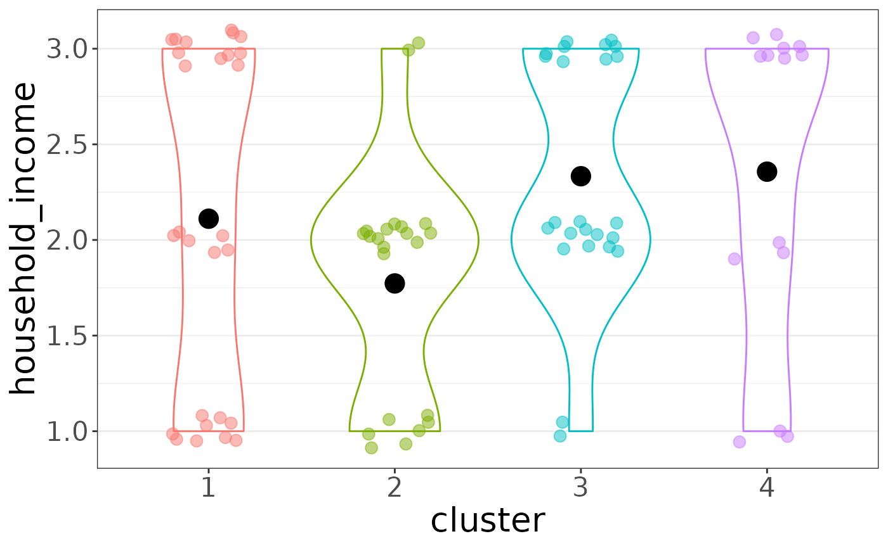
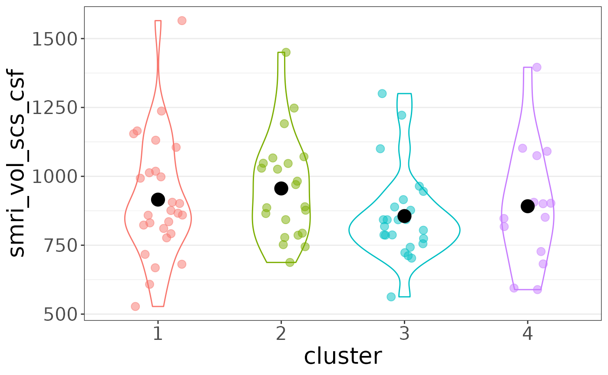
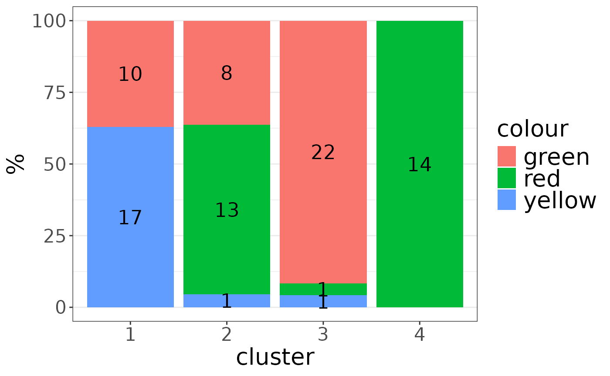
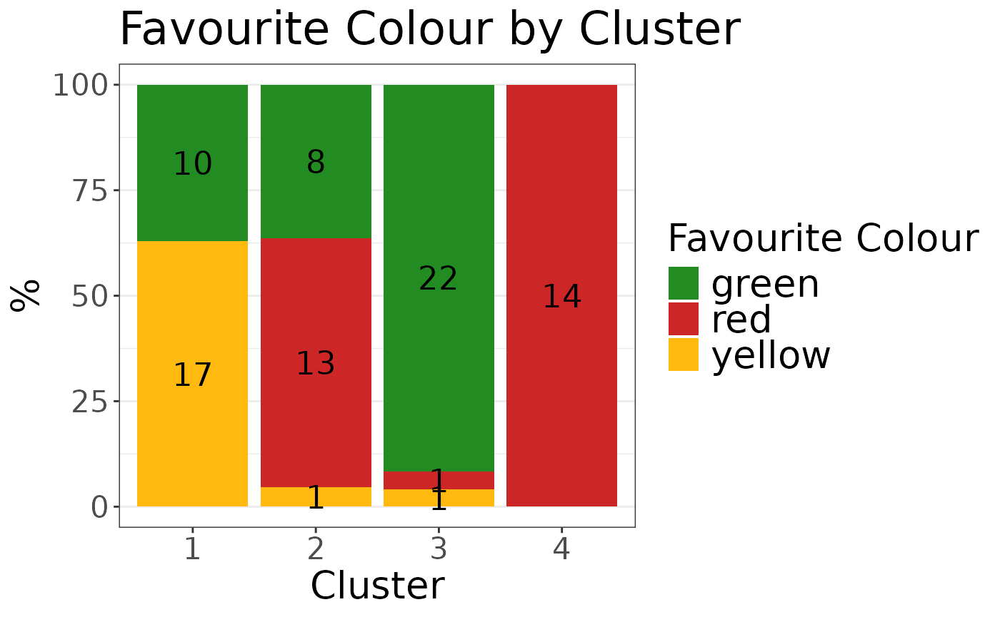

# Feature Plots

Download a copy of the vignette to follow along here:
[feature_plots.Rmd](https://raw.githubusercontent.com/BRANCHlab/metasnf/main/vignettes/feature_plots.Rmd)

Given a cluster solution formatted as a row of a solutions data frame
(or extended solutions data frame) and a data list containing features
to plot, the
[`auto_plot()`](https://branchlab.github.io/metasnf/reference/auto_plot.md)
function can automatically generate `ggplot`-based bar and jitter plots
showing how that particular feature was divided across clusters.

``` r

library(metasnf)

dl <- data_list(
    list(subc_v, "subcortical_volume", "neuroimaging", "continuous"),
    list(income, "household_income", "demographics", "continuous"),
    list(fav_colour, "favourite_colour", "misc", "categorical"),
    list(pubertal, "pubertal_status", "demographics", "continuous"),
    list(anxiety, "anxiety", "behaviour", "ordinal"),
    list(depress, "depressed", "behaviour", "ordinal"),
    uid = "unique_id"
)
```

    ## ℹ 188 observations dropped due to incomplete data.

``` r

# Build space of settings to cluster over
set.seed(42)
sc <- snf_config(
    dl = dl,
    n_solutions = 2,
    min_k = 20,
    max_k = 50
)
```

    ## ℹ No distance functions specified. Using defaults.

    ## ℹ No clustering functions specified. Using defaults.

``` r

# Clustering
sol_df <- batch_snf(dl, sc)

sol_df_row <- sol_df[1, ]
```

The row you pick could come from a `solutions_df` or `ext_solutions_df`
class object.

``` r

plot_list <- auto_plot(
    sol_df_row = sol_df_row,
    dl = dl,
    verbose = TRUE
)
```

    ## Generating plot 1/35: smri_vol_scs_cbwmatterlh
    ## Generating plot 2/35: smri_vol_scs_ltventriclelh
    ## Generating plot 3/35: smri_vol_scs_inflatventlh
    ## Generating plot 4/35: smri_vol_scs_crbwmatterlh
    ## Generating plot 5/35: smri_vol_scs_crbcortexlh
    ## Generating plot 6/35: smri_vol_scs_tplh
    ## Generating plot 7/35: smri_vol_scs_caudatelh
    ## Generating plot 8/35: smri_vol_scs_putamenlh
    ## Generating plot 9/35: smri_vol_scs_pallidumlh
    ## Generating plot 10/35: smri_vol_scs_3rdventricle
    ## Generating plot 11/35: smri_vol_scs_4thventricle
    ## Generating plot 12/35: smri_vol_scs_bstem
    ## Generating plot 13/35: smri_vol_scs_hpuslh
    ## Generating plot 14/35: smri_vol_scs_amygdalalh
    ## Generating plot 15/35: smri_vol_scs_csf
    ## Generating plot 16/35: smri_vol_scs_aal
    ## Generating plot 17/35: smri_vol_scs_vedclh
    ## Generating plot 18/35: smri_vol_scs_cbwmatterrh
    ## Generating plot 19/35: smri_vol_scs_ltventriclerh
    ## Generating plot 20/35: smri_vol_scs_inflatventrh
    ## Generating plot 21/35: smri_vol_scs_crbwmatterrh
    ## Generating plot 22/35: smri_vol_scs_crbcortexrh
    ## Generating plot 23/35: smri_vol_scs_tprh
    ## Generating plot 24/35: smri_vol_scs_caudaterh
    ## Generating plot 25/35: smri_vol_scs_putamenrh
    ## Generating plot 26/35: smri_vol_scs_pallidumrh
    ## Generating plot 27/35: smri_vol_scs_hpusrh
    ## Generating plot 28/35: smri_vol_scs_amygdalarh
    ## Generating plot 29/35: smri_vol_scs_aar
    ## Generating plot 30/35: smri_vol_scs_vedcrh
    ## Generating plot 31/35: household_income
    ## Generating plot 32/35: colour
    ## Generating plot 33/35: pubertal_status
    ## Generating plot 34/35: cbcl_anxiety_r
    ## Generating plot 35/35: cbcl_depress_r

``` r

plot_list$"household_income"
```



``` r

plot_list$"smri_vol_scs_csf"
```



``` r

plot_list$"colour"
```



If there’s something you’d like to change about the plot, you can always
tack on `ggplot2` elements to build from the skeleton provided by
`auto_plot`:

``` r

plot_list$"colour" +
    ggplot2::labs(
        fill = "Favourite Colour",
        x = "Cluster",
        title = "Favourite Colour by Cluster"
    ) +
    ggplot2::scale_fill_manual(
        values = c(
            "green" = "forestgreen",
            "red" = "firebrick3",
            "yellow" = "darkgoldenrod1"
        )
    )
```


