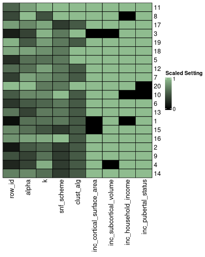

<style>
div.aside { background-color:#fff2e6; }
</style>

```{r, include = FALSE}
knitr::opts_chunk$set(
    collapse = TRUE,
    comment = "#>"
)
```

Download a copy of the vignette to follow along here: [a_less_simple_example.Rmd](https://raw.githubusercontent.com/BRANCHlab/metasnf/main/vignettes/a_less_simple_example.Rmd)

We recommend you go through the [simple example](https://branchlab.github.io/metasnf/articles/a_simple_example.html) before working through this one!

This vignette walks through how this package can be used over a complete SNF-subtyping pipeline.

## Data set-up and pre-processing

### 1. Load the library and data into the R environment

Your data should be loaded into the R environment in the following format:

- The data is in one or multiple *data.frame* objects
- The data is in wide form (one row per patient)
- Any dataframe should one column that uniquely identifies which patient the row has data for

It is fine to have missing data at this stage.

The package comes with a few mock dataframes based on real data from the Adolescent Brain Cognitive Development study:

- `abcd_anxiety` (anxiety scores from the CBCL)
- `abcd_depress` (depression scores from the CBCL)
- `abcd_cort_t` (cortical thicknesses)
- `abcd_cort_sa` (cortical surface areas in mm^2)
- `abcd_subc_v` (subcortical volumes in mm^3)
- `abcd_h_income` (household income on a 1-3 scale)
- `abcd_pubertal` (pubertal status on a 1-5 scale)

Here's what the cortical thickness data looks like:

```{r}
library(metasnf)

class(abcd_cort_t)

dim(abcd_cort_t)

str(abcd_cort_t[1:5, 1:5])

abcd_cort_t[1:5, 1:5]
```

The first column "patient" is the unique identifier (UID) for all subjects in the data.


Here's the household income data:

```{r}
dim(abcd_h_income)

str(abcd_h_income[1:5, ])

abcd_h_income[1:5, ]
```

Putting everything in a list will help us get quicker summaries of all the data.

```{r}
abcd_data <- list(
    abcd_anxiety,
    abcd_depress,
    abcd_cort_t,
    abcd_cort_sa,
    abcd_subc_v,
    abcd_h_income,
    abcd_pubertal
)

# The number of rows in each dataframe:
lapply(abcd_data, dim)

# Whether or not each dataframe has missing values:
lapply(abcd_data,
    function(x) {
        any(is.na(x))
    }
)
```

Some of our data has missing values and not all of our dataframes have the same number of participants.


## Generating the data list

The `data_list` structure is a structured list of dataframes (like the one already created), but with some additional metadata about each dataframe.
It should only contain the input dataframes we want to directly use as inputs for the clustering.
Out of all the data we have available to us, we may be working in a context where the anxiety and depression data are especially important patient outcomes, and we want to know if we can find subtypes using the rest of the data which still do a good job of separating out patients by their anxiety and depression scores.
We'll set aside anxiety and depression for now and use the rest of the data as inputs for our subtyping, which means loading them into the data_list.

```{r}
# Note that you do not need to explicitly name every single named element
# (data = ..., name = ..., etc.)
data_list <- generate_data_list(
    list(
        data = abcd_cort_t,
        name = "cortical_thickness",
        domain = "neuroimaging",
        type = "continuous"
    ),
    list(
        data = abcd_cort_sa,
        name = "cortical_surface_area",
        domain = "neuroimaging",
        type = "continuous"
    ),
    list(
        data = abcd_subc_v,
        name = "subcortical_volume",
        domain = "neuroimaging",
        type = "continuous"
    ),
    list(
        data = abcd_h_income,
        name = "household_income",
        domain = "demographics",
        type = "continuous"
    ),
    list(
        data = abcd_pubertal,
        name = "pubertal_status",
        domain = "demographics",
        type = "continuous"
    ),
    uid = "patient"
)
```

This process removes any patients who did not have complete data across all provided input dataframes.
If you'd like to keep track of that information, you can set the "return_missing" parameter to `TRUE` and receive a list containing the data_list as well as the removed patients:

```{r}
generate_dl_results <- generate_data_list(
    list(
        data = abcd_cort_t,
        name = "cortical_thickness",
        domain = "neuroimaging",
        type = "continuous"
    ),
    list(
        data = abcd_cort_sa,
        name = "cortical_surface_area",
        domain = "neuroimaging",
        type = "continuous"
    ),
    list(
        data = abcd_subc_v,
        name = "subcortical_volume",
        domain = "neuroimaging",
        type = "continuous"
    ),
    list(
        data = abcd_h_income,
        name = "household_income",
        domain = "demographics",
        type = "continuous"
    ),
    list(
        data = abcd_pubertal,
        name = "pubertal_status",
        domain = "demographics",
        type = "continuous"
    ),
    uid = "patient",
    return_missing = TRUE
)

# You only need to do this if you've set `return_missing` to TRUE!
data_list <- generate_dl_results$"data_list"
removed_subjects <- generate_dl_results$"removed_subjects"

removed_subjects[1:10]
```

We can get a summary of our constructed `data_list` with the `summarize_dl` function:

```{r}
summarize_dl(data_list)
```

Each input dataframe now has the same 100 subjects with complete data.

## Generating the settings matrix

The `settings_matrix` stores all the information about the settings we'd like to use for each of our SNF runs.
Calling the `generate_settings_matrix` function with a specified number of rows will automatically build a randomly populated `settings_matrix`.

```{r}
settings_matrix <- generate_settings_matrix(
    data_list,
    nrow = 20,
    min_k = 20,
    max_k = 50,
    seed = 42
)

settings_matrix[1:5, ]
```

The columns are:

- `row_id`: Integer to keep track of which row is which
- `alpha` - A hyperparameter for SNF (variable that influences the subtyping process)
- `k` - A hyperparameter for SNF
- `t` - A hyperparameter for SNF
- `snf_scheme` - the specific way in which input data gets collapsed into a final fused network (discussed further in the [SNF schemes vignette](https://branchlab.github.io/metasnf/articles/snf_schemes.html))
- `clust_alg` - Which clustering algorithm will be applied to the final fused network produced by SNF
- `*_dist` - Which distance metric will be used for the different types of data (discussed further in the [distance metrics vignette](https://branchlab.github.io/metasnf/articles/distance_metrics.html))
- `inc_*` - binary columns indicating whether or not an input dataframe is included (1) or excluded (0) from the corresponding SNF run (discussed further in the [settings matrix vignette](https://branchlab.github.io/metasnf/articles/settings_matrix.html))

Without specifying any additional parameters, `generate_settings_matrix` randomly populates these columns and ensures that no generated rows are identical.

What's important for now is that the matrix (technically a dataframe in the R environment) contains several rows which each outline a different but reasonable way in which the raw data could be converted into patient subtypes.
Further customization of the `settings_matrix` will enable you to access the broadest possible space of reasonable cluster solutions that your data can produce using SNF and ideally get you closer to a generalizable and useful solution for your context.
More on `settings_matrix` customization can be found in the [settings matrix vignette](https://branchlab.github.io/metasnf/articles/settings_matrix.html)

Setting the optional `seed` parameter (which will affect the seed of your entire R session) ensures that the same settings matrix is generated each time we run the code.

While we end up with a random set of settings here, there is nothing wrong with manually altering the settings matrix to suit your needs.
For example, if you wanted to know how much of a difference one input dataframe made, you could ensure that half of the rows included this input dataframe and the other half didn't.
You can also add random rows to an already existing dataframe using the `add_settings_matrix_rows` function (further discussed in the vignette).


## Running SNF for all the rows in the settings matrix

The `batch_snf` function integrates the data in the `data_list` using each of the sets of settings contained in the `settings_matrix`.
The resulting structure is an `solutions_matrix` which is an extension of the `settings_matrix` that contains columns specifying which cluster each subject was assigned for the corresponding `settings_matrix` row.

```{r}
solutions_matrix <- batch_snf(data_list, settings_matrix)

colnames(solutions_matrix)[1:30]
```

It goes on like this for some time.

Just like that, the clustering is done!

You can pull the clustering results out of each row using the `get_cluster_df` function:

```{r}
cluster_solutions <- get_cluster_solutions(solutions_matrix)

head(cluster_solutions)
```

*Note: Parallel processing is available on an older release of the package (v0.2.0) and will be integrated into the latest release shortly. See the "processes" parameter in `?batch_snf`.*

## Picking a solution

Now that we have access to 20 different clustering solutions, we'll need to find some way to pick a favourite (or a few).
In this case, plotting or running stats manually on each of the solutions might be a reasonable way to determine which ones we like the most.
But when the number of solutions generated goes up into the hundreds (or thousands), we're going to need some more automated approaches.

Below are some different tools that you can use to try to pick a solution that is the best for your purposes.

### 1: Examining "meta clusters"

This is the approach introduced by the original meta clustering paper.
This is a good approach to use when you can't quantitatively describe what makes one cluster solution better than another, but you can have an expert compare the two solutions and "intuit" which of the two is more desirable.

The idea is to cluster the clustering solutions themselves to arrive at a small number of qualitatively different solutions.
From there, a user can manually pick out some representative solutions and do the evaluations themselves.

The first step is to calculate the [adjusted Rand index](https://en.wikipedia.org/wiki/Rand_index) (ARI) between each pair of cluster solutions.
This metric tells us how similar the solutions are to each other, thereby allowing us to find clusters of cluster solutions.

```{r}
solutions_matrix_aris <- calc_om_aris(solutions_matrix)
```

We can visualize the resulting inter-cluster similarities with a heatmap:

```{r}
adjusted_rand_index_heatmap(solutions_matrix_aris)
```

You can optionally save your heatmap by specifying a path with the `save` parameter (e.g., `adjusted_rand_index_heatmap(solutions_matrix_aris, save = "./adjusted_rand_index_heatmap.png")`).

```{r echo = FALSE, fig.align = 'center'}
adjusted_rand_index_heatmap(
    solutions_matrix_aris,
    save = "./adjusted_rand_index_heatmap.png"
)
```

{width=400px}

The clustering solutions are along the rows and columns of the above figure, and the cells at the intersection between two solutions show how similar (big ARI) those solutions are to each other.
The diagonals should always be red, representing the maximum value of 1, as they show the similarity between any clustering solution and itself.
Agglomerative hierarchical clustering is being applied to these solutions by default (thank you, `pheatmap` package) so the orders of the clustering solutions here do not exactly line up with the order of the clustering solutions present in the settings matrix.

If you see something interesting in your heatmap, you may be curious to know how that corresponds to the settings that were in your settings matrix.

First, extract the ordering of the rows obtained from the clustering of the cluster solutions:

```{r include = FALSE}
meta_cluster_order <- get_heatmap_order(solutions_matrix_aris)
```

```{r eval = FALSE}
meta_cluster_order <- get_heatmap_order(solutions_matrix_aris)
```

The order is just a vector of numbers...

```{r}
meta_cluster_order
```

... which can be passed into the `settings_matrix_heatmap` function:

```{r include = FALSE}
settings_matrix_heatmap(
    settings_matrix,
    order = meta_cluster_order,
    save = "./settings_matrix_heatmap_ordered.png"
)
```

```{r eval = FALSE}
settings_matrix_heatmap(settings_matrix, order = meta_cluster_order)
```

<center>
{width=400px}
</center>

This heatmap rescales all the columns in the settings_matrix to have a maximum value of 1.
The purpose of re-ordering the settings matrix in this way is to see if any associations exist between certain settings values and pairwise cluster solution similarities.

Maybe you'll see something interesting!

### 2. Quality measures

Quality metrics are another useful heuristic for the goodness of a cluster that don't require any contextualization of results in the domain they may be used in.
r-package enables measures of silhouette scores, Dunn indices, and Davies-Bouldin indices.
To calculate these values, we'll need not only the cluster results but also the final fused network (the similarity matrices produced by SNF) that the clusters came from.
These similarity matrices can be collected from the `batch_snf` using the `return_similarity_matrices` parameter:

```{r}
batch_snf_results <- batch_snf(
    data_list,
    settings_matrix,
    return_similarity_matrices = TRUE
)

solutions_matrix <- batch_snf_results$"solutions_matrix"
similarity_matrices <- batch_snf_results$"similarity_matrices"
```

This time, the output of `batch_snf` is a list.
The first element of the list is a single solutions_matrix, like what we usually get.
The second element is *yet another list* containing one final fused network (AKA similarity matrix / similarity matrix) per SNF run.
Using those two lists, we can calculate the above mentioned quality metrics:

```{r eval = FALSE}
silhouette_scores <- calculate_silhouettes(solutions_matrix, similarity_matrices)

dunn_indices <- calculate_dunn_indices(solutions_matrix, similarity_matrices)

db_indices <- calculate_db_indices(solutions_matrix, similarity_matrices)
```

The first function is a wrapper around `cluster::silhouette` while the second and third come from the *clv* package.
*clv* isn't set as a mandatory part of the installation, so you'll ned to install it yourself to calculate these two metrics.

The original documentation on these functions can be helpful for interpreting and working with them:

1. [`cluster::silhouette` documentation](https://www.rdocumentation.org/packages/cluster/versions/2.1.4/topics/silhouette)
2. [`clv::clv.Dunn` documentation](https://www.rdocumentation.org/packages/clv/versions/0.3-2.1/topics/clv.Dunn)
3. [`clv::clv.Davies.Bouldin` documentation](https://www.rdocumentation.org/packages/clv/versions/0.3-2.1/topics/clv.Davies.Bouldin)


### 3. Stability measures

r-package offers tools to evaluate two different measures of stability:

1. Pairwise adjusted Rand indices (across resamplings of the clustering, on average, how similar was every pair of solutions according to the adjusted Rand index?)
2. Fraction clustered together (what is the average fraction of times that patients who clustered together in the full results clustered together in resampled results?)

To calculate either of these, you'll need to first generate subsamples of the data_list.

```{r eval = FALSE}
data_list_subsamples <- subsample_data_list(
    data_list,
    n_subsamples = 30, # calculate 30 subsamples
    subsample_fraction = 0.8 # for each subsample, use random 80% of patients
)
```

`data_list_subsamples` is a list that now contains 30 smaller subsamples of the original data_list.

Then the stability calculations:

```{r eval = FALSE}
pairwise_aris <- subsample_pairwise_aris(
    data_list_subsamples,
    settings_matrix
)

fraction_together <- fraction_clustered_together(
    data_list_subsamples,
    settings_matrix,
    solutions_matrix
)
```

Be warned, that second function is especially extremely slow.
As the number of patients and number of solutions you're evaluating grows, these functions can get pretty slow.
Consider only using them after eliminating solutions that you are certainly not interested in further characterizing.

### 4. Evaluating separation across "target variables" of importance

**Warning: This approach can very easily result in [overfitting](https://en.wikipedia.org/wiki/Overfitting) your data and producing clustering results that generalize poorly to subjects outside of your dataset.
Consider setting aside some data to validate your results to avoid this issue.**

If you can specify a metric or objective function that may tell you how useful a clustering solution will be for your purposes in advance, that makes the cluster selection process much less arbitrary.

There are many ways to go about doing this, but this package offers one way through the `target_list` structure.
The `target_list` contains dataframes what we can examine our clustering results over through linear regression (continuous data), ordinal regression (ordinal data), or the Chi-squared test (categorical data).

```{r}
target_list <- generate_target_list(
    list(abcd_anxiety, "anxiety", "ordinal"),
    list(abcd_depress, "depressed", "ordinal"),
    uid = "patient"
)

summarize_target_list(target_list)
```

The `target_list` is like the `data_list`, but without the domain attribute.
At this time, each dataframe used to build an target_list must be a single-feature.

Just like when generating the initial `data_list`, we need to specify the name of the column in the provided dataframes that is originally being used to uniquely identify the different observations from each other with the `uid` parameter.

We will next extend our `solutions_matrix` with p-values from regressing the `target_list` features onto our generated clusters.

```{r}
extended_solutions_matrix <- extend_solutions(solutions_matrix, target_list)

colnames(extended_solutions_matrix)[1:25]

# Looking at the newly added columns
head(no_subs(extended_solutions_matrix))
```

If you just want the p-values:

```{r}
target_pvals <- p_val_select(extended_solutions_matrix)

head(target_pvals)
```

There is a heatmap for visualizing this too:

```{r include = FALSE}
pvals_heatmap(
    target_pvals,
    order = meta_cluster_order,
    save = "./pvals_heatmap_ordered.png"
)
```

```{r eval = FALSE}
pvals_heatmap(target_pvals, order = meta_cluster_order)
```

<center>
{width=400px}
</center>

These p-values hold no real meaning for the traditional hypothesis-testing context, but they are reasonable proxies of the magnitude of the effect size / separation of the clusters across the variables in question.
Here, they are just a tool to find clustering solutions that are well-separated according to the outcome measures you've specified.
Finding a cluster solution like this is similar to a supervised learning approach, but where the optimization method is just random sampling.
The risk for overfitting your data with this approach is considerable, so make sure you have some rigorous external validation before reporting your findings.

We recommend using *label propagation* (provided by the SNFtool package in the `groupPredict` function) for validation: take the top clustering solutions found in some training data, assign predicted clusters to some held out test subjects, and then characterize those test subjects to see how well the clustering solution seemed to have worked.

## Validating results with label propagation

Here's a quick step through of the complete procedure, from the beginning, with label propagation to validate our findings.

The `metasnf` package comes equipped with a function to do the training/testing split for you :)

```{r}
# All the subjects present in all dataframes with no NAs
all_subjects <- data_list[[1]]$"data"$"subjectkey"

# Remove the "subject_" prefix to allow merges with the original data
all_subjects <- gsub("subject_", "", all_subjects)

# Dataframe assigning 80% of subjects to train and 20% to test
assigned_splits <- train_test_assign(train_frac = 0.8, subjects = all_subjects)

head(assigned_splits)
tail(assigned_splits)

# Pulling the training and testing subjects specifically
train_subs <- assigned_splits$"subjectkey"[assigned_splits$"split" == "train"]
test_subs <- assigned_splits$"subjectkey"[assigned_splits$"split" == "test"]

# Partition a training set
train_abcd_cort_t <- abcd_cort_t[abcd_cort_t$"patient" %in% train_subs, ]
train_abcd_cort_sa <- abcd_cort_sa[abcd_cort_sa$"patient" %in% train_subs, ]
train_abcd_subc_v <- abcd_subc_v[abcd_subc_v$"patient" %in% train_subs, ]
train_abcd_h_income <- abcd_h_income[abcd_h_income$"patient" %in% train_subs, ]
train_abcd_pubertal <- abcd_pubertal[abcd_pubertal$"patient" %in% train_subs, ]
train_abcd_anxiety <- abcd_anxiety[abcd_anxiety$"patient" %in% train_subs, ]
train_abcd_depress <- abcd_depress[abcd_depress$"patient" %in% train_subs, ]

# Partition a test set
test_abcd_cort_t <- abcd_cort_t[abcd_cort_t$"patient" %in% test_subs, ]
test_abcd_cort_sa <- abcd_cort_sa[abcd_cort_sa$"patient" %in% test_subs, ]
test_abcd_subc_v <- abcd_subc_v[abcd_subc_v$"patient" %in% test_subs, ]
test_abcd_h_income <- abcd_h_income[abcd_h_income$"patient" %in% test_subs, ]
test_abcd_pubertal <- abcd_pubertal[abcd_pubertal$"patient" %in% test_subs, ]
test_abcd_anxiety <- abcd_anxiety[abcd_anxiety$"patient" %in% test_subs, ]
test_abcd_depress <- abcd_depress[abcd_depress$"patient" %in% test_subs, ]

# A data list with just training subjects
train_data_list <- generate_data_list(
    list(train_abcd_cort_t, "cortical_thickness", "neuroimaging", "continuous"),
    list(train_abcd_cort_sa, "cortical_sa", "neuroimaging", "continuous"),
    list(train_abcd_subc_v, "subcortical_volume", "neuroimaging", "continuous"),
    list(train_abcd_h_income, "household_income", "demographics", "continuous"),
    list(train_abcd_pubertal, "pubertal_status", "demographics", "continuous"),
    uid = "patient"
)

# A data list with training and testing subjects
full_data_list <- generate_data_list(
    list(abcd_cort_t, "cortical_thickness", "neuroimaging", "continuous"),
    list(abcd_cort_sa, "cortical_surface_area", "neuroimaging", "continuous"),
    list(abcd_subc_v, "subcortical_volume", "neuroimaging", "continuous"),
    list(abcd_h_income, "household_income", "demographics", "continuous"),
    list(abcd_pubertal, "pubertal_status", "demographics", "continuous"),
    uid = "patient",
    assigned_splits = assigned_splits
)

# Construct the target lists
train_target_list <- generate_target_list(
    list(train_abcd_anxiety, "anxiety", "ordinal"),
    list(train_abcd_depress, "depressed", "ordinal"),
    uid = "patient"
)

# Find a clustering solution in your training data
settings_matrix <- generate_settings_matrix(
    train_data_list,
    nrow = 5,
    seed = 42,
    min_k = 10,
    max_k = 30
)

train_solutions_matrix <- batch_snf(
    train_data_list,
    settings_matrix
)

extended_solutions_matrix <- extend_solutions(
    train_solutions_matrix,
    train_target_list
)

# The fifth row had the lowest minimum p-value across our outcomes
lowest_min_p <- min(extended_solutions_matrix$"min_p_val")
which(extended_solutions_matrix$"min_p_val" == lowest_min_p)

# Keep track of your top solution
top_row <- extended_solutions_matrix[4, ]

# Use the solutions matrix from the training subjects and the data list from
# the training and testing subjects to propagate labels to the test subjects
propagated_labels <- lp_solutions_matrix(top_row, full_data_list)

head(propagated_labels)
tail(propagated_labels)
```

You could, if you wanted, see how *all* of your clustering solutions propagate to the test set, but that would mean reusing your test set and removing the protection against overfitting conferred by this procedure.

```{r}
propagated_labels_all <- lp_solutions_matrix(
    extended_solutions_matrix,
    full_data_list
)

head(propagated_labels_all)
tail(propagated_labels_all)
```

That's all!

If you have any questions, comments, suggestions, bugs, etc. feel free to post an issue at [https://github.com/BRANCHlab/metasnf](https://github.com/BRANCHlab/metasnf).


## References

Caruana, Rich, Mohamed Elhawary, Nam Nguyen, and Casey Smith. 2006. “Meta Clustering.” In Sixth International Conference on Data Mining (ICDM’06), 107–18. https://doi.org/10.1109/ICDM.2006.103.

Wang, Bo, Aziz M. Mezlini, Feyyaz Demir, Marc Fiume, Zhuowen Tu, Michael Brudno, Benjamin Haibe-Kains, and Anna Goldenberg. 2014. “Similarity Network Fusion for Aggregating Data Types on a Genomic Scale.” Nature Methods 11 (3): 333–37. https://doi.org/10.1038/nmeth.2810.
