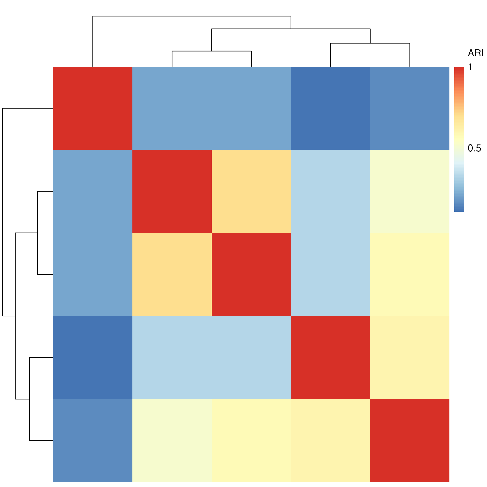
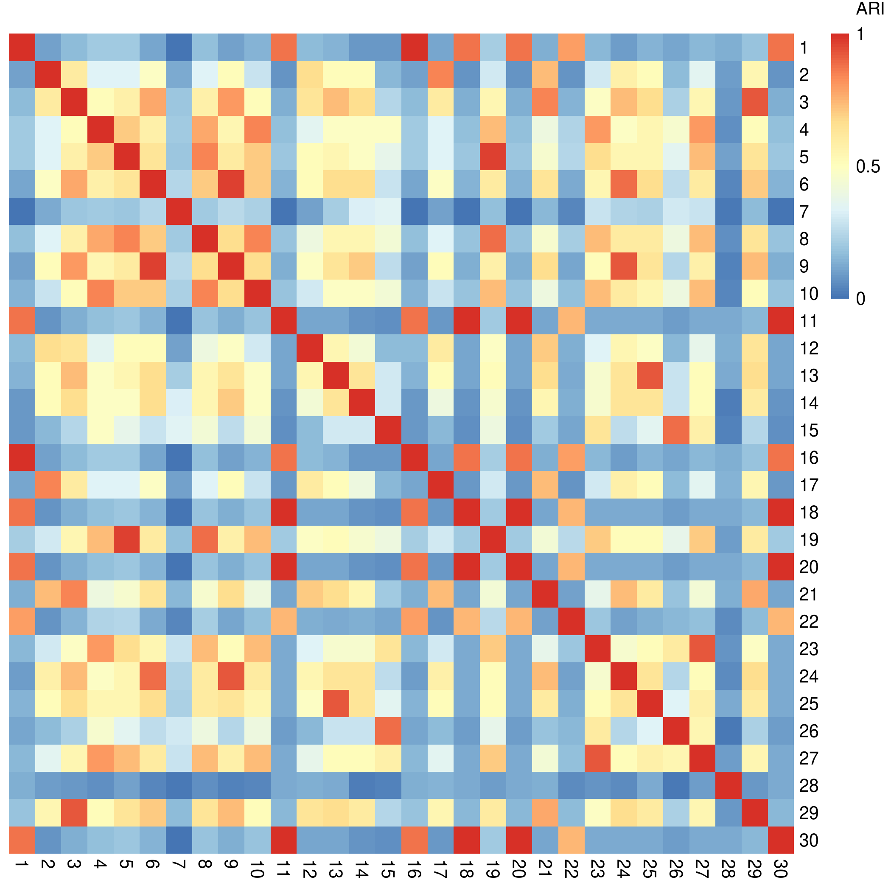
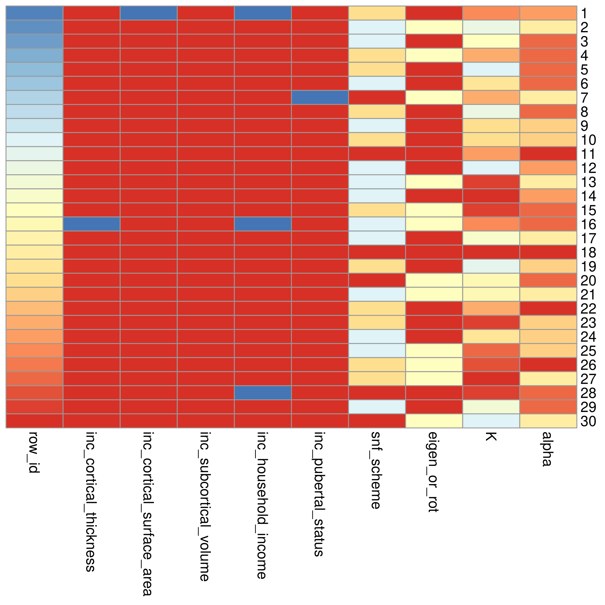
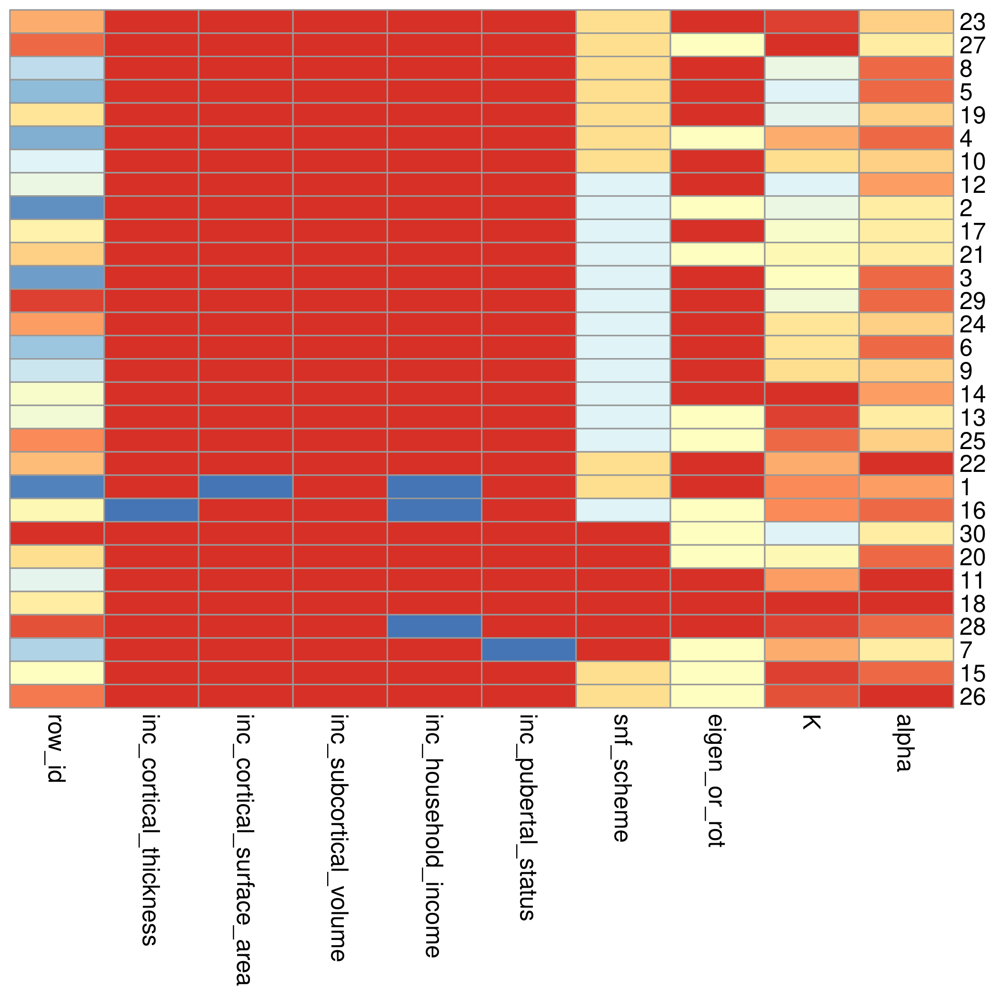
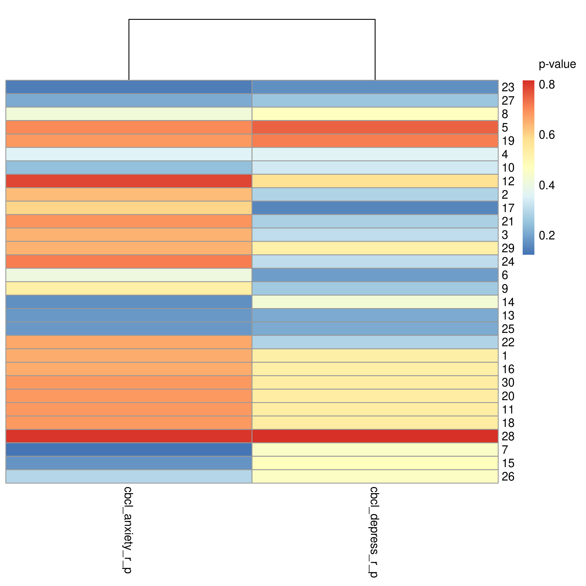

<style>
div.aside { background-color:#fff2e6; }
</style>

```{r, include = FALSE}
knitr::opts_chunk$set(
  collapse = TRUE,
  comment = "#>"
)
```

**What is this package?**

*metasnf* is a package that facilitates usage of the meta clustering paradigm described in [Caruana et al., 2006](https://doi.org/10.1109/ICDM.2006.103) with the similarity network fusion (SNF) data integration procedure developed in [Wang et al., 2014](https://doi.org/10.1038/nmeth.2810).

This package enables repeated iterations of SNF with distinct clustering settings and combinations of input variables.

<br>

**Why use meta clustering?**

Clustering algorithms seek solutions that optimize context-agnostic metrics of quality.
In sufficiently noisy datasets where many qualitatively distinct solutions with similar scores of clustering quality exist, it is not necessarily the case that the top solution selected by a clustering algorithm will also be the most useful one for the user's context.

To address this issue, the original meta clustering procedure [Caruana et al., 2006](https://doi.org/10.1109/ICDM.2006.103) involved generating a large number of reasonable clustering solutions, clusterign those solutions into qualitatively similar ones, and having the user examine those "meta clusters" to find something that seems like it'll be the most useful.

This package offers a wide range of functions that help a user transform their initial, raw data into subtyping solutions that are guided by the context the user is in, characterized across features of interest to the user, and well-validated for generalizability outside of the user's dataset.
The package also offers wrapper functions around the `ggplot2` and `pheatmap` packages to provide sensible default visualizations at various stages of the subtyping process.

This vignette walks through how this package can be used over a complete SNF-subtyping pipeline.

## Data set-up and pre-processing

### 1. Install metasnf

The package is currently hosted on GitHub (not CRAN).
The easiest way to install metasnf is with the devtools package.

```{r eval = FALSE}

install.packages("devtools") # if you don't have it already

# By default, this will install the latest version of the package
devtools::install_github("BRANCHlab/metasnf")

# To ensure you are always installing a specific version of the package,
#  you can manually specify the latest commit:
devtools::install_github(
    "BRANCHlab/metasnf@2b30771ca78c6bc0dcbdd61bba30d32a17cc3fd6"
)

```

### 2. Load the library and data into the R environment

Your data should be loaded into the R environment in the following format:

- The data is in one or multiple *data.frame* objects
- The data is in wide form (one row per patient)
- Any dataframe should one column that uniquely identifies which patient the row has data for

It is fine to have missing data at this stage.

The package comes with a few mock dataframes based on real data from the Adolescent Brain Cognitive Development study:

- `abcd_anxiety` (anxiety scores from the CBCL)
- `abcd_depress` (depression scores from the CBCL)
- `abcd_cort_t` (cortical thicknesses)
- `abcd_cort_sa` (cortical surface areas in mm^2)
- `abcd_subc_v` (subcortical volumes in mm^3)
- `abcd_income` (household income on a 1-3 scale)
- `abcd_pubertal` (pubertal status on a 1-5 scale)
- `abcd_colour` (favourite colour among red, green, and blue)

Here's what the cortical thickness data looks like:

```{r}

library(metasnf)

class(abcd_cort_t)

dim(abcd_cort_t)

str(abcd_cort_t[1:5, 1:5])

abcd_cort_t[1:5, 1:5]

```

The first column `subjectkey` is the unique identifier (UID) for all subjects in the ABCD study.
This will also be the required UID for your data, but don't worry about that just yet.


Here's the household income data:

```{r}
dim(abcd_income)

str(abcd_income[1:5, ])

abcd_income[1:5, ]
```

Putting everything in a list will help us get quicker summaries of all the data.

```{r}
abcd_data <- list(
    abcd_anxiety,
    abcd_depress,
    abcd_cort_t,
    abcd_cort_sa,
    abcd_subc_v,
    abcd_income,
    abcd_pubertal
)

# The number of rows in each dataframe:
lapply(abcd_data, dim)

# Whether or not each dataframe has missing values:
lapply(abcd_data,
    function(x) {
        any(is.na(x))
    }
)
```

Some of our data has missing values and not all of our dataframes have the same number of participants.


## Generating the data list

The `data_list` structure is basically just a list of dataframes (like the one already created), but with some additional features to facilitate repeated clustering.
It should only contain the input dataframes we want to directly use as inputs for the clustering.
I'll set aside the anxiety and depression dataframes for now and just use the other dataframes as clustering inputs.

```{r}
data_list <- generate_data_list(
    list(abcd_cort_t, "cortical_thickness", "neuroimaging", "numeric"),
    list(abcd_cort_sa, "cortical_surface_area", "neuroimaging", "numeric"),
    list(abcd_subc_v, "subcortical_volume", "neuroimaging", "numeric"),
    list(abcd_income, "household_income", "demographics", "numeric"),
    list(abcd_pubertal, "pubertal_status", "demographics", "numeric"),
    old_uid = "patient"
)
```

Building the `data_list` may be the most laborious part of this process.
The first entries are all lists which contains the following elements:

1. The actual dataframe
2. A name for the dataframe (string)
3. A name for the *domain* of the dataframe (string)
4. The type of variable stored in the dataframe (options are numeric, categorical, and mixed)

Finally, there's an argument for the `old_uid` (the column name that currently uniquely identifies all the subjects in your data).

Behind the scenes, this function is building a nested list that keeps track of all this information, but it is also:

- Converting the UID of the data into "subjectkey"
- Removing all observations that contain any NAs
- Removing all subjects who are not present in all input dataframes
- Arranging the subjects in all the dataframe by their UID
- Prefixing the UID values with the string "subject_" to help with cluster result characterization

Any rows containing NAs are removed.
If you don't want a bunch of your data to get slashed because there are a few NAs sprinkled around here and there, consider using [imputation](https://en.wikipedia.org/wiki/Imputation_(statistics)).
The `mice` package in R is nice for this.

We can get a summary of our constructed `data_list` with the `summarize_dl` function:

```{r}
summarize_dl(data_list)
```

Each input dataframe now has the same 100 subjects with complete data.

## Generating the settings matrix

The `settings_matrix` stores all the information about the settings we'd like to use for each of our SNF runs.
Calling the `generate_settings_matrix` function with a specified number of rows will automatically build a randomly populated `settings_matrix`.

```{r}
settings_matrix <- generate_settings_matrix(data_list, nrow = 30, seed = 42)

settings_matrix
```

The columns are:

- `inc*` - binary columns indicating whether or not an input dataframe is included (1) or excluded (0) from the corresponding SNF run (discussed further in the [appendix][inc*])
- `snf_scheme` - the specific way in which input data gets collapsed into a final fused network (discussed further in the [appendix][snf_scheme])
- `eigen_or_rot` binary variable indicating if the eigengap (1) or rotation cost (2) heuristic was used to select the number of clusters specified for applying spectral clustering to the final fused network
- `K` - the nearest neighbors hyperparameter used for SNF (an input to the function SNFtool::SNF)
- `alpha` - Referred to as $\eta$ in the original SNF manuscript, alpha in the SNFtool code examples, and sigma in the SNFtool source code, this is a hyperparameter for affinity matrix generation

`generate_settings_matrix` randomly populates these columns and ensures that no generated rows are identical.
Setting the optional `seed` parameter (which will affect the seed of your entire R session) ensures that the same settings matrix is generated each time we run the code.

While we end up with a random set of settings here, there is nothing wrong with manually altering the settings matrix to suit your needs.
For example, if you wanted to know how much of a difference one input dataframe made, you could ensure that half of the rows included this input dataframe and the other half didn't.
You can also add random rows to an already existing dataframe using the `add_settings_matrix_rows` function.


## Executing the settings matrix

The `batch_snf` function integrates the data in the `data_list` using each of the sets of settings contained in the `settings_matrix`.
The resulting structure is an `solutions_matrix` which is an extension of the `settings_matrix` that contains columns specifying which cluster each subject was assigned for the corresponding `settings_matrix` row.

```{r}
solutions_matrix <- batch_snf(data_list, settings_matrix)

colnames(solutions_matrix)[1:20]
```

It goes on like this for some time.

```{r}
solutions_matrix[1:5, 1:20]
```

Just like that, the clustering is done!

*Note: You can also enable parallel processing to run the `batch_snf` function faster on machines with multiple CPU cores. See the "processes" parameter in `?batch_snf`.*

## Picking a solution #1: examining meta clusters

We now have a group of cluster solutions stored in an `solutions_matrix`.
Proposing tens or hundreds (or thousands) of clustering solutions in a research paper doesn't seem to be fashionable right now, so we will need to pick a solution to move forward with.
In this section, we'll take a look at the cluster-of-clusters approach to picking our favourite solution to move forward with.
I believe this approach is best for truly exploratory clustering (read: when the way in which you prefer to choose between two clustering solutions is through ambiguous vibes).

The first step is to calculate the [adjusted Rand index](https://en.wikipedia.org/wiki/Rand_index) (ARI) between each pair of cluster solutions.
This metric is tells us how similar the solutions are to each other, thereby allowing us to find clusters of cluster solutions.

```{r}
solutions_matrix_aris <- calc_om_aris(solutions_matrix)

dim(solutions_matrix_aris)

```

We can visualize the resulting inter-cluster similarities with a heatmap:

```{r}
ari_heatmap(solutions_matrix_aris)
```

You can optionally save your heatmap by specifying a path with the `save` parameter (e.g., `ari_heatmap(solutions_matrix_aris, save = "./ari_heatmap.png")`).

```{r echo = FALSE, fig.align = 'center'}
ari_heatmap(solutions_matrix_aris, save = "./ari_heatmap.png")
```

{width=400px}

The clustering solutions are along the rows and columns of the above figure, and the cells at the intersection between two solutions show how similar (big ARI) those solutions are to each other.
The diagonals should always be red, representing the maximum value of 1, as they show the similarity between any clustering solution and itself.
Agglomerative hierarchical clustering is being applied to these solutions by default (thank you, `pheatmap` package) so the orders of the clustering solutions here do not exactly line up with the order of the clustering solutions present in the settings matrix.

You can examine the un-clustered heatmap like this:

```{r}
ari_heatmap(
    solutions_matrix_aris,
    cluster_rows = FALSE,
    cluster_cols = FALSE)
```

```{r echo = FALSE, fig.align = 'center'}
ari_heatmap(solutions_matrix_aris,
            cluster_rows = FALSE,
            cluster_cols = FALSE,
            save = "./ari_heatmap_unclustered2.png")
```

<center>
{width=400px}
</center>

And there's an option to hide the corresponding settings matrix rows:

```{r}
ari_heatmap(solutions_matrix_aris, hide_ids = TRUE)
```

The pattern here appears to be a bit of a common theme with the randomly generated settings matrix, owing to the solutions between SNF schemes having significantly more variability than the solutions within SNF schemes (and thus producing 3 rough meta clusters).
If you'd like to try and expand the space of clustering solutions produced even further, consider manually constructing a different settings matrix.
Later updates of this package will focus on customizing the settings matrix a little easier (e.g., choosing which settings matrix parameters stay fixed or what possible values other parameters can take on).

If you see something interesting in your heatmap, you may be curious to know how that corresponds to the settings that were in your settings matrix.

I recommend visualizing the settings matrix with yet another heatmap:

```{r eval = FALSE}
dm_heatmap(settings_matrix)
```

```{r echo = FALSE}
dm_heatmap(settings_matrix, save = "./dm_heatmap.png")
```

<center>
{width=400px}
</center>

The variables beginning with "inc" show when variables were (blue) or were not (red) randomly dropped out.
With only 30 solutions examined and 5 input dataframes, the dropout may seem a little conservative.
As stated above, a future goal is to have the settings matrix yield diverse clustering solutions a little more efficiently, which will likely rely on more aggressive input dataframe dropout (or variable scaling).

You can use the solution order in the clustered ARI heatmap to reorder the settings matrix heatmap:


```{r include = FALSE}
om_ari_order <- get_pheatmap_order(solutions_matrix_aris)
```

```{r eval = FALSE}
om_ari_order <- get_pheatmap_order(solutions_matrix_aris)
```

The order is just a vector of numbers...

```{r}
om_ari_order
```

... which can be passed into the `dm_heatmap` function:

```{r include = FALSE}
dm_heatmap(settings_matrix, order = om_ari_order,
           save = "./dm_heatmap_ordered.png")
```

```{r eval = FALSE}
dm_heatmap(settings_matrix, order = om_ari_order)
```

<center>
{width=400px}
</center>

Maybe you'll see something interesting!

If there's a row that interest you (say, row 5), this format may be more useful for your subsequent analyses:

```{r}
cluster_df <- get_cluster_df(solutions_matrix[5, ])

head(cluster_df)
```

From there, you're on your own (until the next vignette, maybe?)

## Picking a solution #2: specifying an objective function

**Warning: This approach can very easily result in [overfitting](https://en.wikipedia.org/wiki/Overfitting) your data and producing clustering results that generalize poorly to subjects outside of your dataset. Consider setting aside some data to validate your results to avoid this issue.**

If you can specify a metric or objective function that may tell you how useful a clustering solution will be for your purposes in advance, that makes the cluster selection process much less arbitrary.

There are many ways to go about doing this, but this package offers one way through the `outcome_list` structure.
The `outcome_list` contains dataframes what we can examine our clustering results over through linear regression (numeric data), ordinal regression (ordinal data), or the Chi-squared test (categorical data).

```{r}
outcome_list <- generate_outcome_list(
    list(abcd_anxiety, "anxiety", "ordinal"),
    list(abcd_depress, "depressed", "ordinal"),
    list(abcd_colour, "colour", "categorical"),
    old_uid = "patient"
)

summarize_ol(outcome_list)
```

The `outcome_list` is like the `data_list`, but without the domain attribute.
At this time, each dataframe used to build an outcome_list must be a single-feature.

Just like when generating the initial `data_list`, we need to specify the name of the column in the provided dataframes that is originally being used to uniquely identify the different observations from each other with the `old_uid` parameter.

We will next extend our `solutions_matrix` with p-values from regressing the `outcome_list` features onto our generated clusters.

```{r}
extended_solutions_matrix <- extend_om(solutions_matrix, outcome_list)

colnames(extended_solutions_matrix)

# Looking at the newly added columns
head(no_subs(extended_solutions_matrix))
```

If you just want the p-values:

```{r}
p_val_select(extended_solutions_matrix)
```

And of course, there is a heatmap for visualizing this too:

```{r include = FALSE}
om_pvals <- p_val_select(extended_solutions_matrix)

str(om_pvals)

pvals_pheatmap(om_pvals, order = om_ari_order,
           save = "./pvals_pheatmap_ordered.png")

str(om_pvals)
```

```{r eval = FALSE}
om_pvals <- p_val_select(extended_solutions_matrix)

pvals_pheatmap(om_pvals, order = om_ari_order)
```

<center>
{width=400px}
</center>

These p-values hold no real meaning for the traditional hypothesis-testing context.
Here, they are just a tool to find clustering solutions that are well-separated according to the outcome measures you've specified.
Finding a cluster solution like this is similar to a supervised learning approach, but where the optimization method is just random sampling.
The risk for overfitting your data with this approach is considerable, so make sure you have some rigorous external validation before reporting your findings.

I've relied on label propagation (provided by the SNFtool package in the `groupPredict` function) to take my top clustering solution in some training data, assign predicted clusters to some held out test subjects, and then characterized those test subjects to see how well the clustering solution seemed to have worked.

This package provides a wrapper for `SNFtool::groupPredict` to make the label propagation process a little easier to apply to the `solutions_matrix` structure.

## Validating results with label propagation

Here's a quick step through of the complete procedure, from the beginning, with label propagation to validate our findings.

The `metasnf` package comes equipped with a function to do the training/testing split for you :)

```{r}
# All the subjects present in all dataframes with no NAs
all_subjects <- data_list[[1]]$"data"$"subjectkey"

# Remove the "subject_" prefix to allow merges with the original data
all_subjects <- gsub("subject_", "", all_subjects)

# Dataframe assigning 80% of subjects to train and 20% to test
assigned_splits <- train_test_assign(train_frac = 0.8, subjects = all_subjects)

# Partition a training set
train_abcd_cort_t <- keep_split(abcd_cort_t, assigned_splits, "train", old_uid = "patient")
train_abcd_cort_sa <- keep_split(abcd_cort_sa, assigned_splits, "train", old_uid = "patient")
train_abcd_subc_v <- keep_split(abcd_subc_v, assigned_splits, "train", old_uid = "patient")
train_abcd_income <- keep_split(abcd_income, assigned_splits, "train", old_uid = "patient")
train_abcd_pubertal <- keep_split(abcd_pubertal, assigned_splits, "train", old_uid = "patient")
train_abcd_anxiety <- keep_split(abcd_anxiety, assigned_splits, "train", old_uid = "patient")
train_abcd_depress <- keep_split(abcd_depress, assigned_splits, "train", old_uid = "patient")

# Partition a test set
test_abcd_cort_t <- keep_split(abcd_cort_t, assigned_splits, "test", old_uid = "patient")
test_abcd_cort_sa <- keep_split(abcd_cort_sa, assigned_splits, "test", old_uid = "patient")
test_abcd_subc_v <- keep_split(abcd_subc_v, assigned_splits, "test", old_uid = "patient")
test_abcd_income <- keep_split(abcd_income, assigned_splits, "test", old_uid = "patient")
test_abcd_pubertal <- keep_split(abcd_pubertal, assigned_splits, "test", old_uid = "patient")
test_abcd_anxiety <- keep_split(abcd_anxiety, assigned_splits, "test", old_uid = "patient")
test_abcd_depress <- keep_split(abcd_depress, assigned_splits, "test", old_uid = "patient")

# Construct the data lists
train_data_list <- generate_data_list(
    list(train_abcd_cort_t, "cortical_thickness", "neuroimaging", "numeric"),
    list(train_abcd_cort_sa, "cortical_surface_area", "neuroimaging", "numeric"),
    list(train_abcd_subc_v, "subcortical_volume", "neuroimaging", "numeric"),
    list(train_abcd_income, "household_income", "demographics", "numeric"),
    list(train_abcd_pubertal, "pubertal_status", "demographics", "numeric"),
    old_uid = "patient"
)

test_data_list <- generate_data_list(
    list(test_abcd_cort_t, "cortical_thickness", "neuroimaging", "numeric"),
    list(test_abcd_cort_sa, "cortical_surface_area", "neuroimaging", "numeric"),
    list(test_abcd_subc_v, "subcortical_volume", "neuroimaging", "numeric"),
    list(test_abcd_income, "household_income", "demographics", "numeric"),
    list(test_abcd_pubertal, "pubertal_status", "demographics", "numeric"),
    old_uid = "patient"
)
```


Note, in a label propagation workflow, maintaining a consistent ordering of train and test subjects across all dataframes is particularly important.
To ensure the full data list is constructed with an order that is compatible with the training and testing splits made above, you can either specify both the `train_subjects` and `test_subjects` parameters yourself, or provide the `assigned_splits` output from the `train_test_assign` function.

```{r}
full_data_list <- generate_data_list(
    list(abcd_cort_t, "cortical_thickness", "neuroimaging", "numeric"),
    list(abcd_cort_sa, "cortical_surface_area", "neuroimaging", "numeric"),
    list(abcd_subc_v, "subcortical_volume", "neuroimaging", "numeric"),
    list(abcd_income, "household_income", "demographics", "numeric"),
    list(abcd_pubertal, "pubertal_status", "demographics", "numeric"),
    old_uid = "patient",
    assigned_splits = assigned_splits
)

# Construct the outcome lists
train_outcome_list <- generate_outcome_list(
    list(train_abcd_anxiety, "anxiety", "ordinal"),
    list(train_abcd_depress, "depressed", "ordinal"),
    old_uid = "patient"
)

# Find a clustering solution in your training data
settings_matrix <- generate_settings_matrix(train_data_list, nrow = 5, seed = 42)

train_solutions_matrix <- batch_snf(train_data_list, settings_matrix)

extended_solutions_matrix <- extend_om(train_solutions_matrix, train_outcome_list)

# The fourth row had the lowest minimum p-value across our outcomes
which(extended_solutions_matrix$"min_p_val" ==
      min(extended_solutions_matrix$"min_p_val"))

# Keep track of your top solution
top_om_row <- extended_solutions_matrix[4, ]

# Hand over the solutions matrix as well as the full data list to propagate labels
#  to the test subjects
propagated_labels <- lp_om(top_om_row, full_data_list)
head(propagated_labels)
tail(propagated_labels)
```

You could, if you wanted, see how *all* of your clustering solutions propagate to the test set, but that would mean reusing your test set and removing the protection against overfitting conferred by this procedure.

```{r}
propagated_labels_all <- lp_om(extended_solutions_matrix, full_data_list)
head(propagated_labels_all)
tail(propagated_labels_all)
```

That's all for now!

If you have any questions, comments, suggestions, bugs, etc. feel free to post an issue at https://github.com/BRANCHlab/metasnf.

## Appendix

### inc*

This section describes how the `generate_settings_matrix` function randomly assigns input dataframess to be dropped from different SNF runs to access a wider space of possible solutions.

By default, `generate_settings_matrix` will build an empty dataframe containing the columns outlined in the [settings matrix][Generating the settings matrix] section.
If a non-zero number of rows are specified when calling `generate_settings_matrix`, the function calls on `add_settings_matrix_rows` to add rows with randomly valid values.
The input dataframe inclusion variables rely on yet another helper function:

```{r}
random_removal
```

This `random_removal` function randomly picks a number of columns to remove according to an exponential function.
The most likely number of input dataframes to be removed is 0, followed by 1, all the way up to $D - 1$ dataframes where $D$ is the number of provided input dataframes.
The exponential distribution seemed preferrable to a uniform one, which would lead to a large number of input dataframes being dropped on every SNF run.

### snf_scheme

This section describes how individual input dataframes are converted into a final fused network in different ways using the `snf_scheme` parameter.

`snf_scheme`: One consideration of SNF is choosing how to organize individual features (columns) into the input dataframes that get fused by SNF.

In the original SNF paper, input dataframes were organized according to "measurement type": three input dataframes each containing several features related to miRNA, mRNA, or DNA methylation.
In my own work, I had a very large set of input dataframes that had varying amounts of overlap in expected information content, which made the grouping of features a little bit less clear.
For example, consider having input dataframes for (1) the thicknesses of cortical brain regions, (2) the surface areas of cortical brain regions, (3) the volumes of subcortical brain regions, and (4) mean blood pressure.
We have 4 distinct sets of features, 3 distinct sets of units (cortical thickness and subcortical volume both being in $mm^3$), and (arguably) 2 distinct sources of information: structural brain data and blood pressure data.

It is not immediately clear that collapsing the data into any one of those mentioned sets will give rise to the most useful clustering solution for our purpose.
The number of ways in which we can take these individual features and produce a single SNF-fused similarity matrix at the end is quite large.

Here are two examples of getting a single similarity matrix from two single-feature input dataframes:

**Example 1: Concatenation -> single similarity matrix**

```{r}
df1 <- data.frame(
    subjectkey = c("person1", "person2", "person3", "person4"),
    feature1 = c(1, 2, 3, 4)
)

df2 <- data.frame(
    subjectkey = c("person1", "person2", "person3", "person4"),
    feature2 = c(3, 3, 4, 5)
)
```

```{r echo = FALSE}
knitr::kable(
    list(df1, df2),
    format = "pipe",
    caption = "Two individual dataframes, prior to concatenation"
)
```

We start by joining our two features by concatenation:


```{r}
df3 <- dplyr::inner_join(df1, df2, by = "subjectkey")
```

```{r echo = FALSE}
knitr::kable(
    df3,
    format = "pipe",
    caption = "A single concatenated dataframe"
)
```

Giving rise to the following distance matrix:

```{r}
df3_dist <- df3[, 2:3] |>
    stats::dist() |>
    as.matrix() |>
    round(2)
```

```{r echo = FALSE, results = 'asis'}
write_matex <- function(x) {
  begin <- "$$\\begin{bmatrix}"
  end <- "\\end{bmatrix}$$"
  X <-
    apply(x, 1, function(x) {
      paste(
        paste(x, collapse = "&"),
        "\\\\"
      )
    })
  writeLines(c(begin, X, end))
}

write_matex(df3_dist)
```

And subsequent similarity matrix:

```{r}
df3_sim <- SNFtool::affinityMatrix(df3_dist, K = 3, sigma = 0.5) |>
    round(2)
```

```{r echo = FALSE, results = 'asis'}
write_matex(df3_sim)
```

$~$

**Example 2: Similarity matrices -> integration by SNF**

```{r}
df1 <- data.frame(
    subjectkey = c("person1", "person2", "person3", "person4"),
    feature1 = c(1, 2, 3, 4)
)

df2 <- data.frame(
    subjectkey = c("person1", "person2", "person3", "person4"),
    feature2 = c(3, 3, 4, 5)
)
```

We first convert each of our input dataframes into distance matrices:

```{r}
df1_dist <- df1[, 2] |>
    stats::dist() |>
    as.matrix() |>
    round(2)

df2_dist <- df2[, 2] |>
    stats::dist() |>
    as.matrix() |>
    round(2)

```

```{r echo = FALSE, results = 'asis'}
write_matex(df1_dist)

write_matex(df2_dist)
```

We then convert these distance matrices into similarity matrices:

```{r}
df1_sim <- SNFtool::affinityMatrix(df1_dist, K = 3, sigma = 0.5) |>
    round(2)

df2_sim <- SNFtool::affinityMatrix(df2_dist, K = 3, sigma = 0.5) |>
    round(2)
```

```{r echo = FALSE, results = 'asis'}
write_matex(df1_sim)

write_matex(df2_sim)
```

And then we fuse these similarity matrices together using SNF:

```{r}
df1_df2_fused <- SNFtool::SNF(list(df1_sim, df2_sim), K = 3) |>
    round(2)
```

```{r echo = FALSE, results = 'asis'}
write_matex(df1_df2_fused)
```

Contrast this with the similarity matrix we obtained in **Example 1**:

```{r echo = FALSE, results = 'asis'}
write_matex(df3_sim)
```

I'm not entirely sure about what is happening with the diagonal values not being identical in the second matrix, but that aside, the results here seem mostly similar. Person 1 is most similar to person 2, person 2 is most similar to person 1, person 3 is most similar to person 4, and person 4 is most similar to person 3.

*But*

The values aren't identical, and you could imagine that for a more complicated example or a slightly different choice in feature collapsing, the resulting clustering solution would be different.

Going back to the example where our input dataframes are:

1. cortical thicknesses
2. cortical surface areas
3. subcortical volumes
4. mean blood pressure

You could imagine that individually converting each of these 4 input dataframes into 4 separate distance matrices, converting those into similarity matrices, and then fusing those 4 matrices into one single network by SNF could be a little bit skewed in favour of the brain imaging information.
3 of our sources are all describing structural brain features, while 1 source is about the blood.

Varying the `snf_scheme` parameter gives us access to a wider range of possible clustering solutions by changing which of the following approaches are taken to digest the initial input dataframes to a final fused network:

1. Individual: Input dataframes are combined into a final network by SNF.
2. Two-step: Input dataframes are combined within user-specified data domains by one round of SNF and then combined across domains by a second round of SNF.
3. Domain: Input dataframes are combined within domains by concatenation and then combined into a single fused network by SNF.

These options are not comprehensive.
If there are other schemes you would like to be added into the package, feel free to make a request on GitHub.


## References

Caruana, Rich, Mohamed Elhawary, Nam Nguyen, and Casey Smith. 2006. “Meta Clustering.” In Sixth International Conference on Data Mining (ICDM’06), 107–18. https://doi.org/10.1109/ICDM.2006.103.

Wang, Bo, Aziz M. Mezlini, Feyyaz Demir, Marc Fiume, Zhuowen Tu, Michael Brudno, Benjamin Haibe-Kains, and Anna Goldenberg. 2014. “Similarity Network Fusion for Aggregating Data Types on a Genomic Scale.” Nature Methods 11 (3): 333–37. https://doi.org/10.1038/nmeth.2810.
