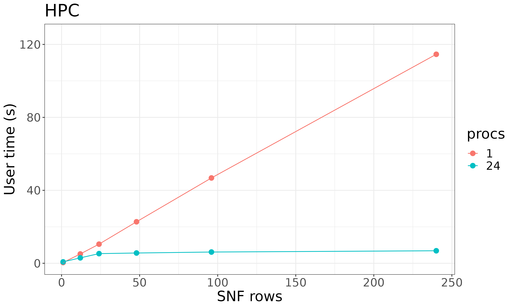

<style>
div.aside { background-color:#fff2e6; }
</style>

```{r, include = FALSE}
# Default chunk options
knitr::opts_chunk$set(
  collapse = TRUE,
  comment = "#>",
  fig.width = 6,
  fig.height = 4.5,
  fig.align = "center"
)
```

Download a copy of the vignette to follow along here: [parallel_processing.Rmd](https://raw.githubusercontent.com/BRANCHlab/metasnf/main/vignettes/parallel_processing.Rmd)

metasnf can use [future apply](https://future.apply.futureverse.org/) to run the rows of a settings matrix in parallel.

Parallel processing has some overhead cost, so it's possible that your particular situation won't greatly benefit (or may even run slower) with parallel processing enabled.

However, if you have access to multiple cores and each integration you are running is quite intensive, the parallel processing will likely help speed things up quite a lot.

## Basic usage

```{r eval = FALSE}
# Load the package
library(metasnf)

# Setting up the data
data_list <- generate_data_list(
    list(abcd_cort_t, "cortical_thickness", "neuroimaging", "continuous"),
    list(abcd_cort_sa, "cortical_surface_area", "neuroimaging", "continuous"),
    list(abcd_subc_v, "subcortical_volume", "neuroimaging", "continuous"),
    list(abcd_income, "household_income", "demographics", "continuous"),
    list(abcd_pubertal, "pubertal_status", "demographics", "continuous"),
    uid = "patient"
)

# Specifying 5 different sets of settings for SNF
settings_matrix <- generate_settings_matrix(
    data_list,
    nrow = 10,
    max_k = 40,
    seed = 42
)

solutions_matrix <- batch_snf(
    data_list,
    settings_matrix,
    processes = "max"
)
```

## Number of processes

Setting processes to "max" will make use of as many cores as R can find.

If you want to dial things back a little, you can specify more precisely the number of processes you want:

```{r eval = FALSE}
solutions_matrix <- batch_snf(
    data_list,
    settings_matrix,
    processes = 4
)
```

To find out how many processes you have access to (or at least, how many metasnf will think you have access to), use the `availableCores()` function from the future package:

```{r eval = FALSE}
library(future)

availableCores()
```

## Benchmarks

Results below show some benchmarking done on the following two systems:

1. A data node on the SickKids HPC ("hpc")
    - Intel Xeon E312xx (SandyBridge, IBRS update)
    - 24 cores
    - 129 GB RAM
2. A home computer ("local")
    - Intel(R) Core(TM) i5-4460 CPU @ 3.20GHz
    - 4 cores
    - 16.7 GB RAM

### Code

```{r eval = FALSE}
library(metasnf)

# Setting up the data
data_list <- generate_data_list(
    list(abcd_cort_t, "cortical_thickness", "neuroimaging", "continuous"),
    list(abcd_cort_sa, "cortical_surface_area", "neuroimaging", "continuous"),
    list(abcd_subc_v, "subcortical_volume", "neuroimaging", "continuous"),
    list(abcd_income, "household_income", "demographics", "continuous"),
    list(abcd_pubertal, "pubertal_status", "demographics", "continuous"),
    uid = "patient"
)

time_data <- data.frame(
    snf_rows = as.numeric(),
    processes = as.numeric(),
    user_time = as.numeric(),
    system_time = as.numeric(),
    elapsed_time = as.numeric()
)

# Code for HPC
for (nproc in c(1, 24)) {
    for (rows in c(1, 12, 24, 48, 96, 240)) {
        settings_matrix <- generate_settings_matrix(
            data_list,
            nrow = rows,
            max_k = 40,
            seed = 42
        )
        start <- proc.time()
        solutions_matrix <- batch_snf(
            data_list,
            settings_matrix,
            processes = nproc
        )
        end <- proc.time()
        time <- end - start
        time_data <- rbind(
            time_data,
            data.frame(
                snf_rows = rows,
                processes = nproc,
                user_time = time["user.self"] + time["user.child"],
                sys_time = time["sys.self"] + time["sys.child"],
                elapsed_time = time["elapsed"]
            )
        )
    }
}

# Code for local
for (nproc in c(1, 4)) {
    for (rows in c(1, 12, 24, 48, 96, 240)) {
        settings_matrix <- generate_settings_matrix(
            data_list,
            nrow = rows,
            max_k = 40,
            seed = 42
        )
        start <- proc.time()
        solutions_matrix <- batch_snf(
            data_list,
            settings_matrix,
            processes = nproc
        )
        end <- proc.time()
        time <- end - start
        time_data <- rbind(
            time_data,
            data.frame(
                snf_rows = rows,
                processes = nproc,
                user_time = time["user.self"] + time["user.child"],
                sys_time = time["sys.self"] + time["sys.child"],
                elapsed_time = time["elapsed"]
            )
        )
    }
}

```

### Results

{width=700px}

The local machine has access to 4 cores and scales quite well in parallel on the toy data.

</br>

{width=700px}

24 cores were requested - quite a massive difference in time taken!

</br>

{width=700px}

This figure zooms in on the performances at both locations.

Some notable observations:

1. Single-threaded HPC (red circles) was slower than the single-threaded local machine (red triangles)
2. Up until 100 rows of SNF, max-process local machine (green triangles) was faster than max process HPC (blue circles)

The point being, neither a super computer cluster nor parallel processing will necessarily improve your run times under all circumstances.
But if you're plowing through big datasets with and running lots of SNF, the parallelization will probably be very helpful.
